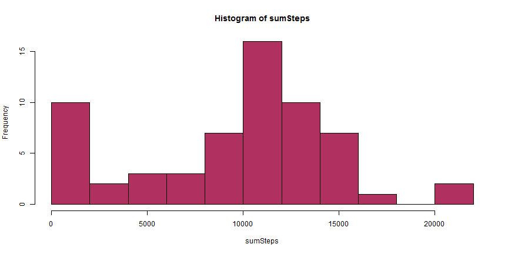
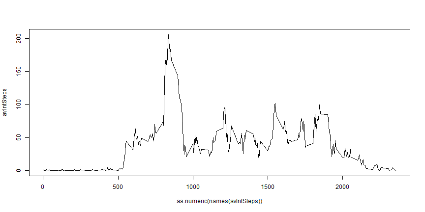
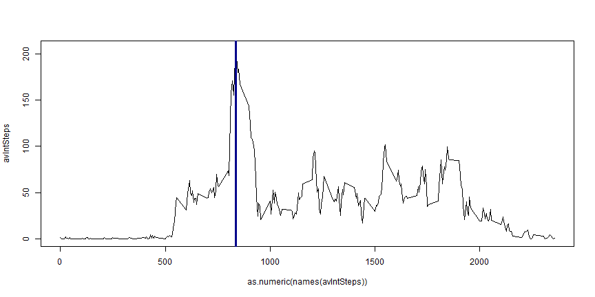
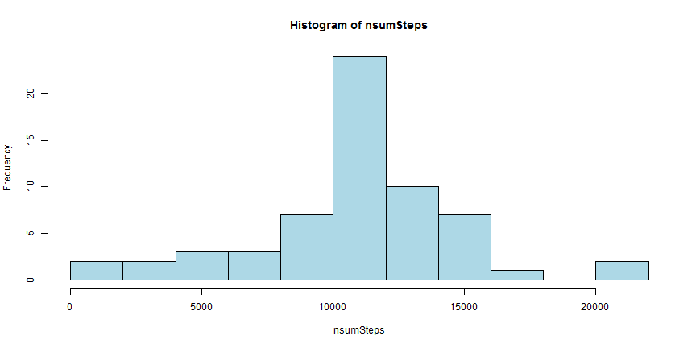
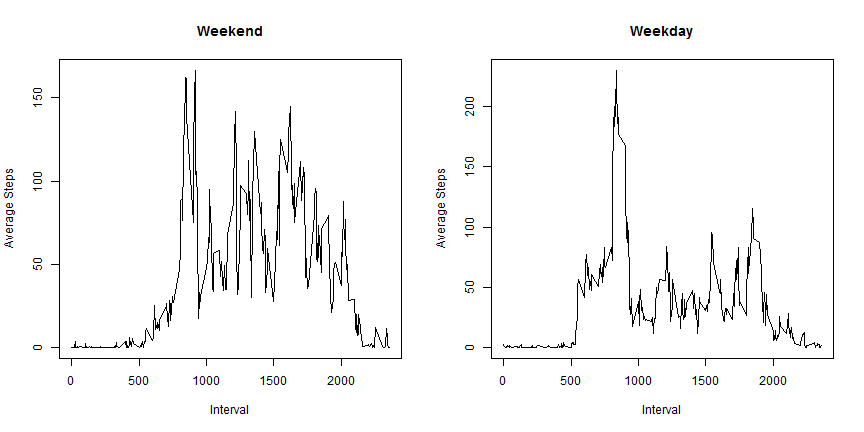

#Reproducible Research 


##Assesement 1  

---


###**Loading and preprocessing the data**

First I'm going to load the raw data.


```r
rData <- read.csv("activity.csv")
```

Let's take a look at the data.


```r
str(rData)
```

```
## 'data.frame':	17568 obs. of  3 variables:
##  $ steps   : int  NA NA NA NA NA NA NA NA NA NA ...
##  $ date    : Factor w/ 61 levels "2012-10-01","2012-10-02",..: 1 1 1 1 1 1 1 1 1 1 ...
##  $ interval: int  0 5 10 15 20 25 30 35 40 45 ...
```

```r
summary(rData)
```

```
##      steps                date          interval     
##  Min.   :  0.00   2012-10-01:  288   Min.   :   0.0  
##  1st Qu.:  0.00   2012-10-02:  288   1st Qu.: 588.8  
##  Median :  0.00   2012-10-03:  288   Median :1177.5  
##  Mean   : 37.38   2012-10-04:  288   Mean   :1177.5  
##  3rd Qu.: 12.00   2012-10-05:  288   3rd Qu.:1766.2  
##  Max.   :806.00   2012-10-06:  288   Max.   :2355.0  
##  NA's   :2304     (Other)   :15840
```

I observe that the *date* column is a factor.  
I will convert the data that it contains into dates.


```r
tData <- data.frame(steps = rData$steps, date = as.Date(rData$date, "%Y-%m-%d"), interval = rData$interval)
```


The data are now suitable for analysis.


---

###**What is mean total number of steps taken per day?**

I will first calculate the total steps taken per day, ignoring the NAs.


```r
sumSteps <- tapply(tData$steps, tData$date ,sum, na.rm = T)
```


Let's now plot the histogram of the total steps taken each day.


```r
hist(sumSteps,10, col = "maroon")
```



Now I will calculate the mean and the median of the total number of steps taken per day.


```r
meanSteps <- mean(sumSteps)
medSteps <- median(sumSteps)
meanSteps
```

```
## [1] 9354.23
```

```r
medSteps
```

```
## [1] 10395
```

---

###**What is the average daily activity pattern?**

I will make a time series plot of the 5-minute intervaland the average number of steps taken, averaged across all days.


```r
avIntSteps <- tapply(tData$steps, tData$interval, mean, na.rm = T)
plot(x = as.numeric(names(avIntSteps)), y = avIntSteps, type = "l" )
```



Now I will find the 5-minute interval, on average across all the days in the dataset, that contains the maximum number of steps.


```r
# First find which element has the maximum value and its name (interval)
maxIntSteps <- which.max(avIntSteps)
maxInt <- as.numeric(names(maxIntSteps))
# Plot interval on the time series chart
plot(x = as.numeric(names(avIntSteps)), y = avIntSteps, type = "l" )
abline(v=maxInt, lwd = 3, col = "darkblue")
```



```r
maxInt
```

```
## [1] 835
```

So, as shown above, the 5-minute interval that contains the maximum mnumber of steps is the 835th.

---

###**Imputing missing values**

Now let's go back to the raw data and try to impute the missing values (NAs).

First I will calculate the number of missing values.


```r
mValues <- sum(is.na(rData$step))
mValues
```

```
## [1] 2304
```

Now I will replace the missing values with the mean for the relative 5-min interval.


```r
# First find the indices of the NAs in the step column of the data
mInd <- which(is.na(rData$steps))

# Then create a vector with the intervals that has NAs
mInt <- rData$interval[mInd]

#Find the values that I want to replace NAs with

mValRepl <- apply(as.array(mInt), 1, FUN = function(x,y) y[names(y)==x], 
                  y=avIntSteps)

# Replace
nData <- data.frame(steps = replace(rData$steps, mInd, mValRepl), 
                    date = as.Date(rData$date), interval = rData$interval)
```

So **nData** is the new dataset that is equal to the original one but with the missing data filled in.

Let's replot the histogram and calculate the mean and the median of total number of steps taken per day. 


```r
nsumSteps <- tapply(nData$steps, nData$date ,sum)
hist(nsumSteps,10, col = "lightblue")
```



```r
nmeanSteps <- mean(nsumSteps)
nmedSteps <- median(nsumSteps)
nmeanSteps
```

```
## [1] 10766.19
```

```r
nmedSteps
```

```
## [1] 10766.19
```

We observe that imputing missing values changed both the mean and the median.
That was expected since initially NAs were calculated as 0s so the mean was decreased and the difference between mean and median was increased.

Imputing missing values solved that problem. Histogram shows that the averages distribution looks more like normal (that seems right according to the Central Limit Theorem) and mean equals to the median.

---

###**Are there differences in activity patterns between weekdays and weekends?**


Now I will separate the weekdays from weekends.
To do that I will add a factor col in our dataset.


```r
library(dplyr)

# Change language from greek to english
Sys.setlocale("LC_TIME", "English")
```

```
## [1] "English_United States.1252"
```

```r
weekdays1 <- c("Monday", "Tuesday", "Wednesday", "Thursday", "Friday")

# Add the new column
nData <- mutate(nData, day.type = factor((weekdays(nData$date) %in% weekdays1),
                                         levels=c(FALSE, TRUE), 
                                         labels=c('weekend', 'weekday'))) 
```

Now I will make a panel plot containing a time series plot of the 5-minute interval and the average number of steps taken, averaged across all weekday days or weekend days.


```r
#First I will divide the dataset into two subsets using the day.type factor

nDataWE <- nData[nData$day.type == "weekend",]
nDataWD <- nData[nData$day.type == "weekday",]

avIntStepsWE <- tapply(nDataWE$steps, nDataWE$interval, mean)
avIntStepsWD <- tapply(nDataWD$steps, nDataWD$interval, mean)

# I will plot 2 charts arranged in 2 rows and 1 column

par(mfrow = c(1,2))

plot(x = as.numeric(names(avIntStepsWE)), y = avIntStepsWE, type = "l", 
     xlab = "Interval", ylab = "Average Steps", main = "Weekend" )
plot(x = as.numeric(names(avIntStepsWD)), y = avIntStepsWD, type = "l",
     xlab = "Interval", ylab = "Average Steps", main = "Weekday" )
```


